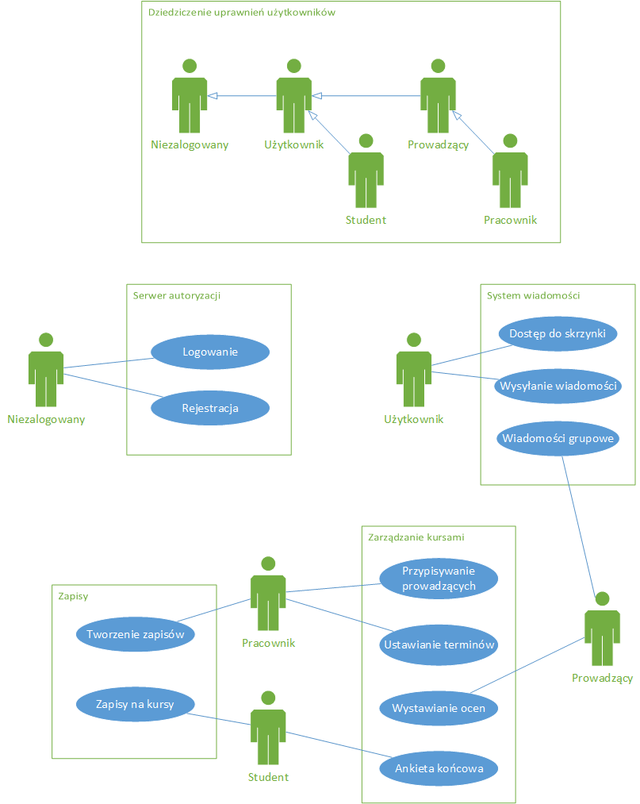
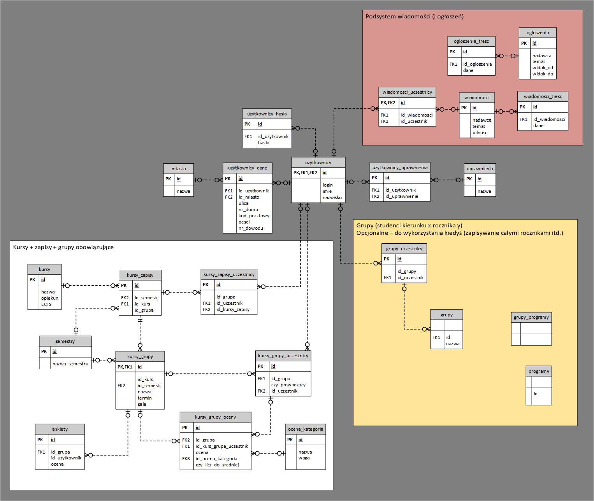

# SystemObslugiStudentow

Nowy wspaniały projekt.

## Jak rust to ogarnąć wypada
* Coś do nauczenia się rusta xD
	* https://www.rust-lang.org/learn
	* https://doc.rust-lang.org/beta/
* Coś do obsługi baz danych
	* https://diesel.rs/
	* https://github.com/perdumonocle/sql-builder
* Coś do zrobienia gui
	* https://github.com/linebender/druid
	* https://github.com/MoAlyousef/fltk-rs
	* https://github.com/woboq/qmetaobject-rs
	* https://dev.to/davidedelpapa/rust-gui-introduction-a-k-a-the-state-of-rust-gui-libraries-as-of-january-2021-40gl

## Baza danych do testów
* XAMPP: https://www.apachefriends.org/pl/index.html
	* Zintegrowany webserwer z aplikacją do zarządzania mysql (phpMyAdmin)
	* Ew zwykła instalacja mySQL + jakiś tool do zarządzania
* Zaimportowanie sos.sql (docelowo będzie *kiedyś* zawierał właściwą bazę danych)

## Gdyby był problem z bibliotekami dla diesela
* Zainstalować: https://downloads.mysql.com/archives/c-c/
* Dodać zmienną środowiskową MYSQLCLIENT_LIB_DIR wskazującą na C:\Program Files\MySQL\MySQL Connector C 6.1\lib\vs14

## Gdyby wymagało builda nightly rusta
* rustup toolchain install nightly
* rustup default nightly

## Założenia projektowe

* Zewnętrzna (?wewnętrzna - sqlite???) baza danych - praca aplikacji na zasadzie nakładki do bazy.
	* Dzięki temu możliwość przepisania systemu w przyszłości / dodania appki mobilnej
* Docelowo postawienie bazy danych na jakimś vpsie/chmurze
* System magazynowy / sprzedażowy / jsos 3.0? Zakładana realizacja:
	* Podsystemu użytkowników (zarządzanie z uprawnieniami etc.)
		* W takim razie też może księgowość/wypłaty?
		* Podsystem HR?
	* Podsystemu wiadomości
	* Podsystemu z danymi (magazyn/zamówienia/kursy/zapisy etc.)
		* Zarządzanie magazynem (ew zasobami np kursami)
		* Tworzenie czegoś
		* Usuwanie czegoś
		* Edycja czegoś
* (Ew. aplikacja mobilna może być po prostu rozszerzeniem niektórych funkcji:)
	* Przy tworzeniu czegoś możliwość wprowadzenia "kodu produktu" zczytując qr/barcode

  
UML na miarę naszych możliwości:   

  
A tak wygląda **wstępna koncepcja** bazy danych:   
